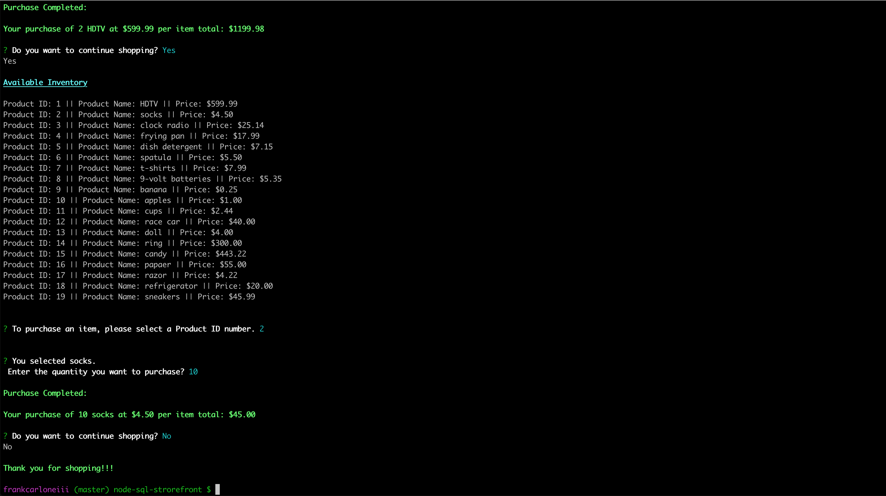
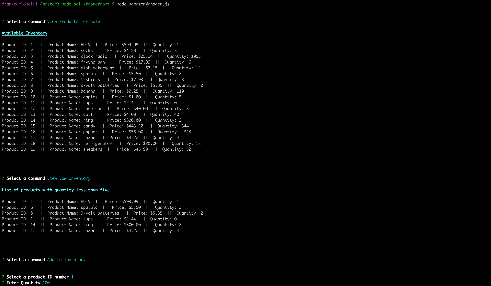
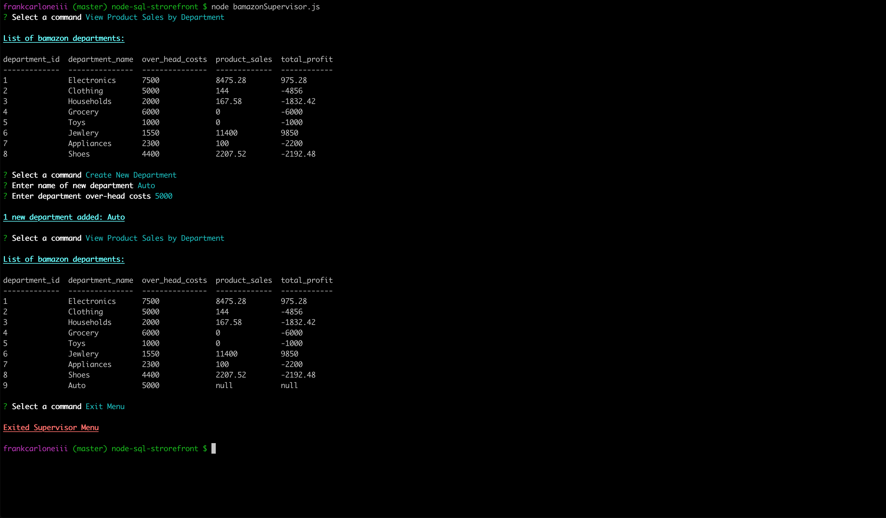

# Node SQL Storefront

## This application records product inventory in a SQL database and prompts the user based on view selected.

#### This application has three views: Customer, Manager and Supervisor
* The Customer view will take in orders from customers and deplete stock from the store's inventory.  
* The Manager view will list products for sale, list products with quantity below five, add to quantity of an existing product and add a new product.  
* The Supervisor view will display a summarized table of profits by department and the ability to create a new department.

#### Software/libraries used for this application:
JavaScript - for the applications logic  
Node.js - to execute the application in the terminal (outside the browser)  
mysql - Node.js driver for mysql  
Inquirer.js - command-line user interface to prompt for and handle user input  
colors.js - to style the Node.js application in the console  

### Install Node SQL Storefront: 
1. Open a terminal 
2. Clone the node-sql-storefront repository  
3. Install the packages associated with this application  
`npm install`  
4. Enter the file name associated with the view type (see view type for file name)  

### Customer View Instructions:  
In the terminal type the following command to start the Customer view:  
`node bamazonCustomer.js`  

The customer can:  
- View a list of products available for sale
- Enter the Product ID number of the item you want to purchase
- Then enter the quantity you want to purchase
  - The customer is notified if the quantity you enter is greater than what is currently in stock
-  The customer is notified when the purchase is completed and given the sales total

See Customer View Demo below to see a video demonstration

### Manager View Instructions:  
In the terminal type the following command to start the Manager view:  
`node bamazonCustomer.js`

Manager view has the option to:
1. View Products for Sale
2. View Low Inventory
3. Add to Inventory 
4. Add New Product
5. Exit Menu

`View Products for Sale` displays a full inventory list  

`View Low Inventory` displays an inventory list for products with stock quantity less than five  

Instructions for `Add to Inventory` menu option:
- Enter a Product ID number for the item you want to add quantity
- Then enter the quantity 

Instructions for `Add New Product` menu option:
- Enter the product name you want to add
- Choice a department name the new product pertain to
- Enter the product's unit price
- Enter the product's quantity

See Manager View Demo below to see a video demonstration

### Supervisor View Instructions:  
In the terminal type the following command to start the Manager view:  
`node bamazonSupervisor.js` 

Supervisor view has the option to:
1. View Product Sales by Department 
2. Create New Department 
3. Exit Menu

`View Product Sales by Department` will display a summarized table of profits by department

Instructions for `Create New Department` menu option:
- Enter the name of the new department
- Enter the amount of the over-head costs

See Supervisor View Demo below to see a video demonstration

### Video Demonstrations:

#### Customer View Video
  

#### Manager View Video   
  

#### Supervisor View Video  
  
